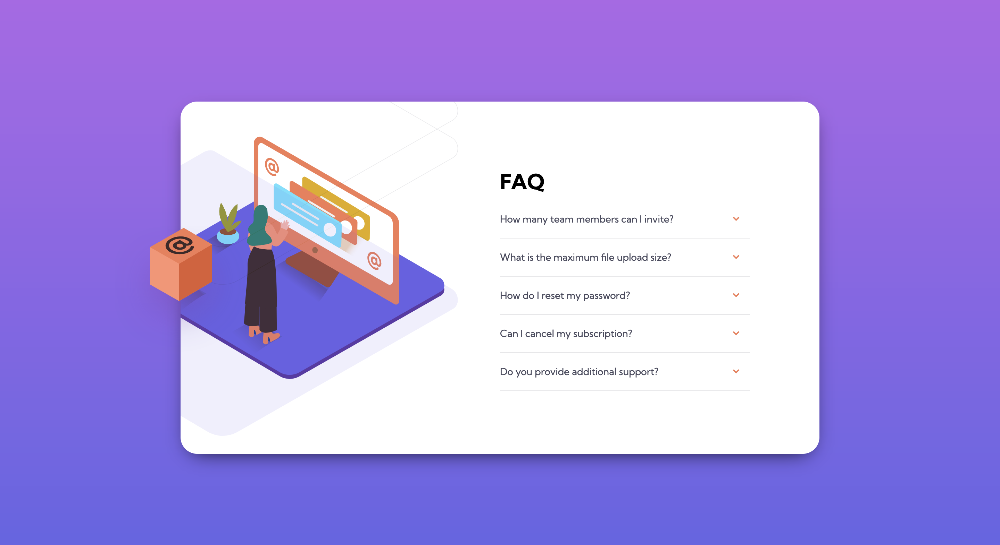
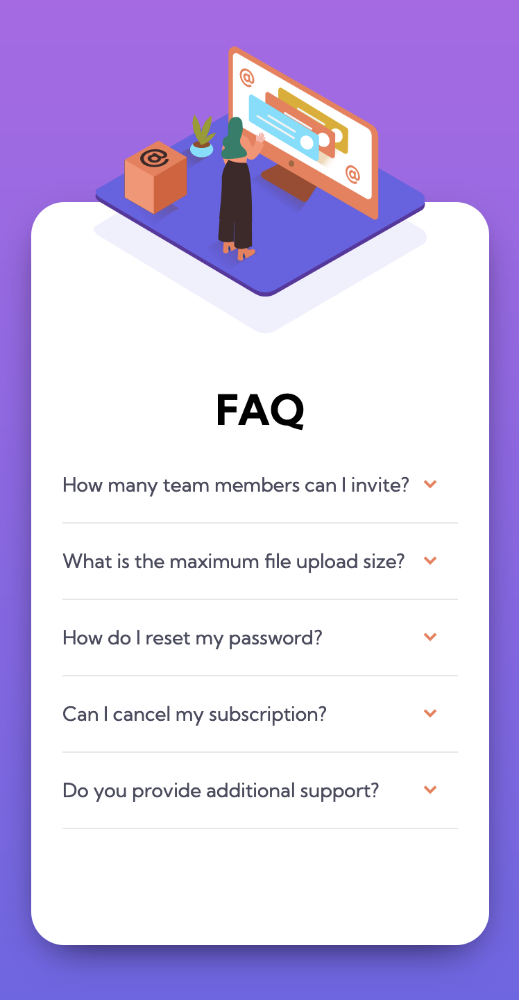

# Frontend Mentor - FAQ accordion card solution

This is a solution to the [FAQ accordion card challenge on Frontend Mentor](https://www.frontendmentor.io/challenges/faq-accordion-card-XlyjD0Oam). Frontend Mentor challenges help you improve your coding skills by building realistic projects. 

## Table of contents

- [Overview](#overview)
  - [The challenge](#the-challenge)
  - [Screenshot](#screenshot)
  - [Links](#links)
- [My process](#my-process)
  - [Built with](#built-with)
- [Author](#author)

### The challenge

Users should be able to:

- See hover states for all interactive elements on the page
- See a live countdown timer that ticks down every second (start the count at 14 days)
- **Bonus**: When a number changes, make the card flip from the middle

### Screenshots

### Links

- Solution URL: [here](https://github.com/HectorMartinDama/FAQ-accordion-card)
- Live Site URL: [here](https://faq-accordion-card-seven-umber.vercel.app/s)

### Built with

- Flexbox
- Mobile-first workflow
- Partials
- [SASS/SCSS](https://sass-lang.com/) - SASS

## Author

- Frontend Mentor - [@HectorMartinDama](https://www.frontendmentor.io/profile/HectorMartinDama)
- Linkedin - [@Héctor Martín](http://linkedin.com/in/héctor-martín-a88a761a2)